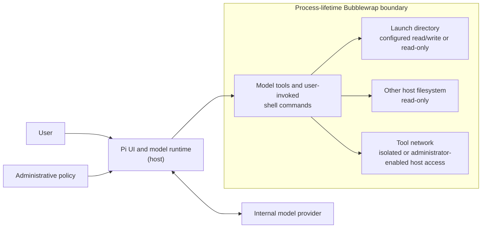

# Pi Sandbox

Pi Sandbox is a managed distribution of [Pi](https://github.com/earendil-works/pi)
for user-invoked, interactive sessions. It enforces administrator-defined policy
for every model-invoked tool and runs built-in operations through an
administrator-selected execution backend.

Pi Sandbox is intended for administrators and engineers using internally hosted
models to work on servers, including production systems. Typical uses include
troubleshooting, log review, and preparing configuration files, with explicit
administrative control over model tools' ability to modify files or access
production services.

## Purpose and scope

In the default Linux Bubblewrap mode, Pi Sandbox runs model tools and
user-invoked `!` shell commands inside a Bubblewrap boundary. By default, direct filesystem changes are confined to the directory
from which the user launched it, while the rest of the ordinary host filesystem
is mounted read-only. `filesystem.hidden_paths` masks selected existing files and directories while
restoring the launch workspace through a hidden parent. Setting
`filesystem.cwd_writable = false` also makes the
launch directory read-only, while preserving writable private temporary storage. Within the launch directory, administrators determine
which model tools are available and which permitted tools require user
approval. They also determine whether tool networking is isolated or allowed to
use the host network. Approval operates within the limits established by that
policy and the sandbox boundary. Linux and macOS also support explicit direct
mode, which preserves tool exposure, approval policy, bounded process handling,
and typed tools but provides no filesystem or network containment.

Pi Sandbox is designed for interactive use with an attentive user. Its boundary
governs operations routed through `pi-sandbox` and complements the account and
server controls that govern other software run by the logged-in user.

## Isolation at a glance



## What it enforces

- The ordinary host filesystem, except configured hidden files and directories, is visible at its normal absolute paths and
  mounted read-only. The launch directory is explicitly bound at the same path,
  read/write or read-only according to `filesystem.cwd_writable`, and is the
  working directory for every built-in tool and shell operation.
- Administrator policy determines whether model tools capable of modifying
  files in the launch directory are available and whether they require user
  approval.
- One process-lifetime sandbox provides private temporary and runtime
  directories shared by tool calls in that Pi invocation, administrator-selected
  network isolation or host-network access, and a sanitized environment that
  excludes ambient provider tokens and host socket descriptors while admitting
  only explicitly configured, model-visible sandbox variables.
- All seven Pi tools (`read`, `grep`, `find`, `ls`, `write`, `edit`, and `bash`)
  and user `!` commands use the selected backend. The model-visible `bash` tool
  can be disabled while typed tools remain available; human `!` remains fixed-allow.
- Administrative policy always starts at the config path compiled from the
  build-selected distribution manifest; its
  required `models_file` selects the complete model catalog. Pi's internal model
  catalog is disabled.
- The main configuration defines the global scoped environment. An optional
  root broker can combine named or numeric user/group rules into a patch for environment, model
  catalog, execution backend, network mode, CWD write access, and complete per-tool policy
  overrides without exposing other users' files.
  Pi, sandbox, and individual managed-extension variables remain isolated; the
  environment never enables a tool or grants approval.
- The Pi Sandbox extension is forced inline. User- and directory-local
  extensions, built-in extension factories, stock tool implementations, and Pi
  package-management commands are disabled.
- A build-selected distribution manifest statically composes managed tools and
  standard Pi tool-only extensions. Both use the same per-tool policy; managed
  extensions additionally use Pi Sandbox's bounded host-command contract. On
  Linux it also selects either an unmanaged system Bubblewrap path or a
  verified Bubblewrap binary bundled beneath Pi Sandbox's libexec directory.
- Every model tool has an explicit `allow`, `ask`, `deny`, or `disabled`
  policy. Optional session grants are memory-only and independently configurable
  for each tool.
- Configuration, model files, host prerequisites, and the selected executor
  probe are checked before the interactive application starts.
- Interactive execution is available only to unprivileged Unix users. The
  application refuses to start Pi when its effective UID is root; this has no
  configuration override.

The sandbox boundary applies to tool and shell processes. Pi handles model API
connectivity separately on the host, so tool-network isolation does not
interrupt configured model providers. Filesystem reads remain subject to the
Unix account's permissions. See the [security model](docs/security.md) for
detailed guarantees and trust assumptions.

## Distribution and operation

The release contains a precompiled Bun application built from an exactly pinned,
minimally patched Pi release, the separately maintained Pi Sandbox extension,
and the extension manifests selected by its distribution manifest.
Linux packages also include a small static Rust identity broker that is
inactive unless configured:

```text
pi-sandbox
  -> managed Pi
     -> forced Pi Sandbox extension and approval policy
     -> selected Bubblewrap worker or direct executor
        -> one bounded direct-argv child per tool or shell operation
```

Installed hosts need supported Linux or macOS plus the platform prerequisites
listed in the installation guide. A system or bundled Bubblewrap provider is
required only for Linux Bubblewrap mode.

```sh
sudo ./install.sh
cd /path/to/directory
pi-sandbox
```

Run the installer as root, but launch `pi-sandbox` as the intended unprivileged
user. The executable permits its installer-only validation commands as root but
refuses to start Pi with effective UID `0`.

A normal upgrade preserves the compiled configuration directory. Use
`install.sh --replace-config`
only when intentionally deploying the configuration packaged with a release.
See [installation and operation](docs/installation.md).

Pi Sandbox has its own release version. A tagged `0.6.0` build using Pi `1.1.0`
shows `1.1.0+ps.0.6.0` in `pi-sandbox --version` and the TUI header. Development
builds add source identity. See [versions and releases](docs/releases.md) for
the independent version numbers and source-only GitHub release process.

`PI_CODING_AGENT_DIR` continues to select user-owned sessions, settings, skills,
themes, and logs. It does not redirect policy, the selected model catalog, or
extension loading.

## Configuration

The default distribution's administrative inputs are:

```text
/etc/pi-sandbox/config.toml
/etc/pi-sandbox/models.json
```

A version-3 distribution manifest with `allow_config_override = true` enables
a leading `--config FILE` option for caller-selected policy. Managed builds
set it to `false` and reject the flag. The selected TOML still requires an
absolute `models_file`; no built-in model catalog is enabled.

Broker mode may additionally use root-managed
`/etc/pi-sandbox/users.d/*.toml` and `/etc/pi-sandbox/groups.d/*.toml` drop-ins. Both directories are optional;
without a matching file the main configuration applies unchanged.
See [user and group environment and overrides](docs/identity-broker.md).

Policy configuration is strict and versioned. Every model tool must be present;
missing, unreadable, invalid, and unknown policy fields stop startup. Details
and a complete example are in
[configuration and approvals](docs/configuration.md).
Provider definitions, API-key resolution, and model troubleshooting are in
[models and authentication](docs/models.md).

## Interactive diagnostics

The `/sandbox` command reports the initialized boundary without exposing secrets or
adding content to the model conversation. Use `/sandbox mounts` for the concise
effective mount policy, `/sandbox policy` for all tool policies, the fixed user
shell behavior, and current session grants, or `/sandbox policy <subject>` for one subject. See
[configuration and approvals](docs/configuration.md#interactive-diagnostics).

## Development

Development requires Node.js 24 or newer. Keep `NODE_ENV` unset:

```sh
env -u NODE_ENV npm ci
env -u NODE_ENV npm run verify:release
```

Tests are offline and never contact a live model provider. See
[testing](docs/testing.md).

## Documentation

These subject documents collectively describe the current product behavior.

- [Architecture](docs/architecture.md)
- [Configuration and approvals](docs/configuration.md)
- [Models and authentication](docs/models.md)
- [User and group environment and overrides](docs/identity-broker.md)
- [Installation and operation](docs/installation.md)
- [Versions and releases](docs/releases.md)
- [Security model](docs/security.md)
- [Testing](docs/testing.md)
- [Pi integration and upgrade contract](specs/pi-integration.md)

## License

[MIT](LICENSE)

## Upstream attribution

Pi Sandbox incorporates a pinned, minimally modified build of
[Pi](https://github.com/earendil-works/pi), Copyright (c) 2025 Mario Zechner,
distributed under the
[MIT License](https://github.com/earendil-works/pi/blob/v1.1.0/LICENSE). The
exact upstream version, commit, and source archive are recorded in
[`pi-source.lock.json`](pi-source.lock.json); Pi Sandbox's changes to that source
are maintained in [`patches/pi`](patches/pi/).
