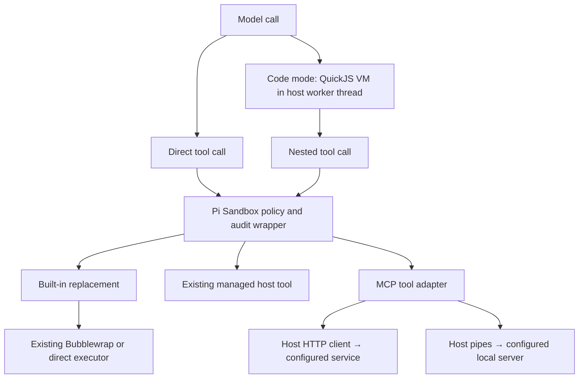

# Managed MCP and code mode

Status: implemented and verified on the feature branch. Iterative Keel code
review with `claude-default` completed cleanly, including the final URL scope change.
Keel spec review with `claude-default` completed cleanly after two review rounds.

Prepared 2026-10-09 against Pi Sandbox `d5e7233` and pinned Pi 1.0.2,
commit `cd32f7725fdbddbaecdff5b1e68491563394e0ca`. Finalization and review
history are recorded under Correspondence. This document records the design
and implementation plan. The maintained subject documents and
[Pi integration contract](pi-integration.md) describe the implemented behavior.

## 1. Decisions and scope

1. Keep Pi, its UI, credentials, provider connections, and session storage on
   the host. Keep the existing Bubblewrap/direct executor for the seven built-in
   replacements and user shell. Do not move Pi or MCP servers into Bubblewrap.
2. Integrate Pi's existing MCP extension and client transports through the forced
   Pi Sandbox extension. Support Streamable HTTP and host stdio in the same
   implementation. Do not add a separate MCP protocol implementation.
3. Only administrative configuration can define servers, endpoints, commands,
   credentials, and permissions. Read only user `mcp.json` presentation preferences
   for admitted servers; ignore project MCP files. Keep the MCP management CLI
   and executable-extension discovery disabled.
4. Make code mode available with an administrative boolean; let Pi settings, CLI
   selection, and permitted MCP exposure control activation. There is no
   `[tools.codemode]`, outer approval prompt, or grant that bypasses nested tool
   policy. Code mode orchestrates the currently callable, policy-wrapped tools.
5. Every nested built-in, managed-extension, and MCP invocation uses its ordinary
   permission and execution boundary. A nested `ask` waits for UI approval.
6. MCP permissions are ordered wildcard rules within each server, with an
   explicit complete default policy. No individual tool admission list is
   required. Newly discovered tools inherit the rules/default automatically.
7. HTTP authentication initially uses configured headers or explicit environment
   references. Browser OAuth, provider-token reuse, and automatic authentication
   discovery are deferred, as selected by the user.
8. Initial MCP scope is **tools**. Resources, resource templates, prompts,
   sampling, elicitation, MCP apps, and `tool_search` are not enabled. This avoids
   introducing ungoverned operations outside the requested tool-policy model.
   Embedded tool-result content is handled as data, not as a new capability.
9. New feature/server policy is main-TOML-only in this implementation. Existing
   broker overrides continue to govern built-ins and compiled extension tools,
   including calls from code mode. New per-user/group MCP or code-mode policy
   overrides are out of scope.

Non-goals include sandboxed local MCP, arbitrary JavaScript/Node execution on the
host, new sandbox networking modes, runtime MCP package installation, user-added
servers, code-mode-only presentation, and CPU/cgroup policy.

## 2. Execution and trust boundaries



Code-mode scripts have JavaScript computation plus selected bridge functions;
they receive no Node APIs, filesystem, environment, arbitrary module loading,
process spawning, sockets, or general fetch function. QuickJS/WebAssembly and
its host bridge are trusted implementation components. This is language
isolation inside a host process, not an OS containment claim. A bridge/runtime
defect remains a host-side risk.

A host stdio MCP server is trusted installed executable code with the invoking
account's host authority. Its executable, dependencies, configuration discovery,
and any children are outside Bubblewrap. An HTTP server exercises its own
service authority; it may be remote or a service on this host. Tool permissions
control the requests Pi issues, not server startup, background activity, or the
server's internal implementation. A stdio server can access the account's files
independently of whether a particular MCP tool is denied.

`network.mode = "none"` and `filesystem.hidden_paths` continue to constrain
sandboxed built-ins only. They do not restrict either MCP transport, code-mode
session-state writes, existing managed host tools, or Pi provider traffic.
Diagnostics and documentation must label both MCP transports as host capabilities.
MCP tool descriptions, annotations, instructions, and results are untrusted model
context; hints such as `readOnlyHint` never grant permission.

The supported managed distribution still has `allow_config_override = false`.
Development builds that explicitly permit `--config` delegate policy selection
to their caller, as today; this spec does not claim otherwise. Administrator
ownership remains an installation responsibility, not a new runtime file-owner
check or protection against the trusted Unix account owner.

## 3. Administrative configuration

Use the next strict configuration version: **10** if implemented directly on the
current version 9. If another change advances the schema first, use the next
unused version and update the examples together. Reject the prior schema; do not
add aliases, automatic migration, or a second configuration source.

Require `[codemode]` and `[mcp.servers]`. Packaged defaults disable code mode and
contain an empty server table. Existing `[tools.*]` remains the exact catalog of
seven built-ins and selected compiled-extension tools. Reject `tools.codemode`
and dynamic MCP names there; MCP policy belongs under its server.

### Example

```toml
# Fragment of a complete policy. Existing sections and tool policies still apply.
config_version = 10

[codemode]
enabled = true
timeout_ms = 300000

[mcp.servers.docs]
enabled = true
transport = "http"
url = "https://docs.example.com/mcp"
exposure = "direct"
timeout_ms = 60000
headers_from_env = { Authorization = "DOCS_AUTHORIZATION" }

[mcp.servers.docs.default_policy]
mode = "ask"
session_grant = "never"
audit = true

[[mcp.servers.docs.tool_rules]]
match = "search_*"
mode = "allow"
session_grant = "never"
audit = true

[[mcp.servers.docs.tool_rules]]
match = "delete_*"
mode = "deny"
session_grant = "never"
audit = true

[mcp.servers.local_docs]
enabled = true
transport = "stdio"
command = "/opt/company/mcp-docs/bin/server"
args = ["--stdio"]
exposure = "codemode"
env = { CACHE_DIR = "~/.cache/company-mcp" }
env_from_env = { SERVICE_TOKEN = "LOCAL_DOCS_TOKEN" }

[mcp.servers.local_docs.default_policy]
mode = "ask"
session_grant = "offer"
audit = true
```

The environment referenced above must supply the complete header value, such as
`Bearer ...`; no credential interpolation is performed. These are administrative
references, not model-selected variable names.

### Field contracts

| Field                   | Contract                                                                                                                                                                                                                                                |
| ----------------------- | ------------------------------------------------------------------------------------------------------------------------------------------------------------------------------------------------------------------------------------------------------- |
| `codemode.enabled`      | Required boolean; controls availability, not forced activation.                                                                                                                                                                                         |
| `codemode.timeout_ms`   | Optional integer, default 300000, range 1000–3600000. Hard overall deadline, including nested approval waits.                                                                                                                                           |
| `mcp.servers`           | Required table, empty is valid; at most 32 entries.                                                                                                                                                                                                     |
| Server identifier       | Case-sensitive ASCII `[a-z][a-z0-9_]{0,31}`; stable administrative identity.                                                                                                                                                                            |
| `enabled`               | Required boolean. Disabled means no connection, process, credential resolution, or exposed tools.                                                                                                                                                       |
| `transport`             | Required `http` or `stdio`; validate the selected shape and reject fields of the other shape.                                                                                                                                                           |
| `exposure`              | Required `direct` or `codemode`; default presentation, not permission.                                                                                                                                                                                  |
| `timeout_ms`            | Optional integer, default 60000, range 1000–3600000; absolute per-call deadline after approval, including reconnect/setup and result handling. Progress cannot extend it.                                                                               |
| `default_policy`        | Required complete `{ mode, session_grant, audit }`, using the existing values and validation.                                                                                                                                                           |
| `tool_rules`            | Optional ordered array, default empty, at most 256 entries. Each entry has `match` and a complete policy; no partial-policy inheritance.                                                                                                                |
| HTTP `url`              | Required literal absolute HTTPS URL, or HTTP only for literal loopback hosts (`localhost`, `127.0.0.1`, `[::1]`). Ordinary query parameters are supported. No macro interpolation, raw braces, dot segments, userinfo, or fragment. Maximum 4096 bytes. |
| HTTP `headers`          | Optional map of literal header values, default empty.                                                                                                                                                                                                   |
| HTTP `headers_from_env` | Optional map from outgoing header name to one effective host environment variable name, default empty.                                                                                                                                                  |
| Stdio `command`         | Required normalized absolute executable path; no tilde expansion, PATH search, or shell evaluation.                                                                                                                                                     |
| Stdio `args`            | Optional literal string array, default empty; no interpolation or shell wrapper added by Pi Sandbox.                                                                                                                                                    |
| Stdio `env`             | Optional map of explicit environment values, default empty; bare `~`, leading `~/`, and account macros expand using the OS-account resolver.                                                                                                            |
| Stdio `env_from_env`    | Optional map from child variable name to one effective host variable name, default empty.                                                                                                                                                               |

Reject unknown keys, duplicates, NUL/control characters where illegal, malformed
headers/variable names, and size violations before connection. Require literal
and referenced destination maps to be disjoint (case-insensitively for HTTP).
Reject HTTP overrides of transport-controlled headers such as `Host`,
`Content-Length`, `Connection`, `Accept`, `Content-Type`, `Mcp-Session-Id`, and
`Mcp-Protocol-Version`. `Authorization` is permitted. Reject CR/LF in all resolved
header values. Limit each map to 64 entries, each resolved value to 16 KiB, and
combined resolved server headers/environment to 64 KiB. Limit command/argv to
128 entries and 64 KiB combined UTF-8 bytes. All administrative server and rule
configuration is limited to 256 KiB before resolved secrets.
Violations caused by per-account resolved values, including CR/LF and size
violations, use the server-only `credentials-unavailable` path below; structural
and literal configuration violations abort startup.

An enabled server with `exposure = "codemode"` requires `codemode.enabled = true`;
otherwise startup fails. Disabled servers may retain that exposure. Missing
required fields and malformed dormant configuration are still errors, but
installation validation and disabled servers must not resolve per-user secrets
or attempt connections.

### Credential and environment resolution

After broker merging and existing Pi environment application, capture a private
snapshot of the effective host environment. Each logical MCP session resolves
only the variable names explicitly referenced by its enabled servers against
that snapshot. A missing/empty reference or invalid resolved per-account value
makes only that server unavailable with a sanitized `credentials-unavailable`
status; do not connect it or fall back to another credential source. Unrelated
built-ins, code mode, and other MCP servers remain usable. This is distinct from
malformed administrative syntax, invalid literal headers, or invalid reference
names, which abort application startup before any connection.

Never expose the environment snapshot to scripts, MCP descriptions, audit
records, or other servers. No implicit lookup by server name, provider identity,
project contents, `${...}`, or `!command` exists. Installation validation does
not resolve credentials. The configuration and effective environment snapshot
are fixed for the Pi process; changing policy or credentials requires restarting
the application. Session replacement/reload reuses that snapshot and cannot
ingest new user/project configuration or ambient environment mutations.

For HTTP, construct headers from literals and resolved references and pass them
directly to the managed transport. For stdio, pass `inheritEnv: false` and build
its environment from fixed platform values plus its explicit maps. The fixed
baseline is `PATH=/usr/local/bin:/usr/bin:/bin`, `LANG=C.UTF-8`, `LC_ALL=C.UTF-8`,
`HOME` from the effective OS account, account `USER`/`LOGNAME`, and `TMPDIR=/tmp`.
On macOS, use the host-supported UTF-8 locale instead of assuming `C.UTF-8`;
platform baseline selection is compiled and tested. Admin maps may replace
baseline values intentionally. Preserve existing admission rules against runtime
injection variables (`NODE_OPTIONS`, `BUN_OPTIONS`, preload variables, etc.).
Other ambient variables, including Pi provider credentials, do not flow into a
stdio server unless explicitly mapped by the administrator. This is credential
separation, not containment against trusted host server code.

The stdio CWD is always the captured canonical launch CWD. There is no separate
MCP CWD setting. Installation checks command syntax; operational startup checks
that enabled commands are executable before starting any server. A missing or
nonexecutable command marks only that server `executable-unavailable` for the
process lifetime; skip its credential projection and launch, and continue with
other servers and built-ins. Report only the sanitized category, without host
error details. Disabled servers skip this check. Restart after deployment repairs
the executable. Invalid command syntax remains a structural configuration error
that aborts startup. Dependencies must already be installed by deployment.
Pi Sandbox does not download packages.
Arguments may name administrator-installed launchers, but no `npx`/`uvx` setup is
performed by this product.

Existing broker `environment.pi` values can supply explicitly named credential
references per account without adding a new broker scope. The new MCP settings,
ordered policies, and code-mode switch are not accepted in broker override
payloads or rule files. Keep audit selection parent-only and existing strict
validation of known compiled tools in broker patches.

### Account macros

In addition to existing bare `~` and leading `~/` expansion, support exactly
`{{username}}` and `{{uid}}` in configured hidden paths, all configured scoped
environment values, and explicit stdio `env` values. Resolve the effective UID
and canonical username from the invoking account's OS database, using the same
lookup as account-home expansion; never use ambient `USER`, `LOGNAME`, `HOME`,
or `SUDO_USER`. UID is decimal text. Resolve once after broker merging and before
applying environment values. Substitution is single-pass and never expands the
replacement text recursively. Unknown/malformed account macro syntax is rejected
in these fields; `{{{{` and `}}}}` escape literal opening/closing double braces.
Existing path/environment validation and size bounds apply after expansion.
Installation validation checks syntax without resolving the installer's account.
Inherited ambient values and values read through `*_from_env` are not templated.

HTTP `url` is literal and does not support macro interpolation. Preserve ordinary
query parameters and existing percent escapes without decoding/re-encoding them.
Reject raw braces, dot segments, userinfo, and fragments before connection;
percent-encoded braces remain literal URL data. Validate the 4096-byte bound
without any account lookup. Account names and UIDs are identifiers, not credentials.

MCP URLs, executable paths, stdio argv, installation/config/model paths, HTTP literal
headers, policy names and arbitrary configuration strings remain outside macro
expansion. Missing account identity fails operational configuration resolution
when identity expansion is needed. An invalid resolved stdio env value
makes only that enabled server unavailable with a sanitized configuration-value
failure category; malformed template syntax aborts startup. Disabled servers do
not resolve account macros solely for their own settings.

## 4. Permission matching and tool identity

Match against the server's **original MCP tool name**, before any Pi name
sanitization, truncation, hashing, or JavaScript identifier conversion. Server
identifiers scope rules; a pattern never matches tools from another server.

Pattern syntax is case-sensitive whole-string matching with `*` matching zero or
more characters. All other permitted characters are literal. No regex, `?`,
character classes, braces, path glob semantics, escaping, or expressions. Reject
unsupported pattern syntax rather than silently treating it as another matcher.
Require a nonempty pattern of at most 128 UTF-8 bytes. Implement a bounded glob
matcher without constructing potentially exponential regular expressions.

Evaluate rules in file order. The first matching rule supplies the complete
policy, including `session_grant` and `audit`; otherwise use `default_policy`.
There is no special priority for exact matches, no merge of matching rules, and
no dependence on server discovery order. Duplicate patterns are configuration
errors; overlapping patterns are allowed and intentionally ordered.

| Resolved mode | Visibility and behavior                                                                      |
| ------------- | -------------------------------------------------------------------------------------------- |
| `allow`       | Exposed according to server exposure; dispatch without a prompt.                             |
| `ask`         | Exposed; await the normal approval UI for each call unless an allowed session grant applies. |
| `deny`        | Exposed; return a policy denial before any request is sent.                                  |
| `disabled`    | Omit from callable catalog, declarations, code-mode discovery, and execution.                |

New tools automatically receive this policy. A broad `allow` rule or default
intentionally admits future matching tools; `ask` requires approval; `disabled`
keeps unmatched tools unavailable. Tool annotations never override the result.

Policy identity is the structured pair `(serverId, originalToolName)`. Session
grants apply to that exact pair, never to a wildcard rule, entire server, or code
mode. Use an injective internal encoding (for example a JSON tuple with a kind
field) rather than concatenating strings with ambiguous delimiters. An `offer`
grant has the same session-wide subject semantics as existing built-ins.

Refactor the policy engine's static-record lookup into a trusted subject resolver
that returns a complete `SubjectPolicy` and its revision, or no subject. Static
built-in/extension subjects resolve from effective `[tools.*]`; admitted MCP
subjects resolve from the current catalog's typed identity and server rules.
The resolver is injected by the managed runtime and cannot be supplied in tool
arguments. A missing, disabled, or withdrawn subject cannot dispatch. Resolve
and bind the policy/revision before evaluation, then recheck it after an approval
wait and before execution. There is one decision path, one prompt mutex, and one
session-grant store for static and dynamic subjects; no parallel MCP policy
engine or prompt queue. Store grants against subject plus admission revision
and provide targeted invalidation for affected MCP subjects, preserving unrelated
built-in grants. A stale prompt may neither execute nor recreate an invalidated
grant. Session shutdown clears all subjects' grants together.

Keep a mapping from generated Pi tool names to typed provenance and the live
server/tool revision. Reuse Pi's public naming convention where unambiguous;
never recover authority by parsing `mcp__...` names, descriptions, or result
metadata. Reserve the `mcp__` prefix and `codemode` against compiled-extension
collisions. Validate generated names and normalized JavaScript identifiers across
the entire callable catalog. Resolve raw-name sanitization collisions using Pi's
stable hash scheme; reject unresolved collisions rather than aliasing tools.
Once assigned, a display name cannot change ownership within a logical session.

Accept raw tool names only as nonempty UTF-8 strings up to 128 bytes with no
control/NUL characters or invalid Unicode. Compare literal characters without
Unicode normalization. Bound tool schemas and descriptions as part of the
catalog limits below; reject duplicate raw tool names or invalid schemas as an
invalid server catalog. Treat `__proto__` and other special property names as
ordinary data via safe maps, never prototype-bearing object assignment.

## 5. Registration, exposure, and dispatch

Keep one forced Pi Sandbox factory. It composes the managed code-mode and MCP
adapters without enabling general built-in factories or user extensions. Both
transport types use the same catalog, permission resolver, approval wrappers,
audit path, and result adapter. Only transport creation differs.

The current `registerPiToolExtensions()` contract remains for fixed compiled
extensions. Add a separate internal managed-MCP registration path; do not loosen
that contract to arbitrary late registrations. New dynamic tools are authorized
only when they have provenance from an admitted server in the active runtime.

Pi's MCP extension must offer a generic adaptation hook carrying the original
server entry and tool definition **before every publication**, including initial
registration, refreshed definitions, reappearance, and withdrawn/hidden
registrations. The managed adapter applies permissions and wraps execution before
calling Pi's real registration API. Do not briefly publish an unwrapped tool.
Keep privileged policy knowledge in Pi Sandbox, not in upstream MCP code.

Build and validate each server catalog replacement off to the side, then publish
it atomically in the host event loop. Unknown or malformed catalogs leave that
server unavailable and invalidate its pending approvals; never partially admit
an unchecked list. For removed tools, tombstone the old implementation and hide
its declaration. Stale references must reject even if a caller retained the old
`execute` closure.

Every invocation follows this sequence:

1. Resolve current typed identity and immutable tool/schema revision. Apply the
   current user tool-selection filters and server/tool availability.
2. Validate the arguments against that admitted schema and freeze the exact
   snapshot used for approval and dispatch. Never send model-controlled fields
   as transport parameters, headers, server names, or endpoint selectors.
3. Start audit handling when selected; evaluate the resolved tool policy.
4. For `ask`, await the existing serialized prompt queue. Display server and raw
   tool name plus bounded identifying arguments; built-in nested prompts show a
   path or command preview. Do not rely on a standalone nested tool card: Pi's
   interactive mode suppresses those cards. Transport credentials are not part
   of the preview. Approval always applies to the frozen arguments.
5. After approval and before dispatch, recheck cancellation, runtime generation,
   connection/catalog revision, availability, and policy revision. Any change
   invalidates that invocation; return an error requiring a fresh call, never
   silently substitute a refreshed implementation under the old approval.
6. Record execution intent before the side effect, dispatch once, and report a
   bounded result or error through Pi's ordinary result path.

Catalog revision changes include tool schema, descriptions, and annotations;
unchanged refreshes preserve grants. Reconnects invalidate pending approvals and
session grants for that server. Catalog changes invalidate grants for affected
tools, including removed/re-added tools. A generation guard is checked both when
queued work starts and immediately before a transport send.

`direct` tools are declared to the model and callable from enabled code mode.
`codemode` tools are callable only through code mode and discoverable through its
`ALL_TOOLS`, `searchTools`, and description helpers. Do not register `tool_search`.
Code mode is inactive by default. Honor merged global/project `defaultTools`, CLI
selection, and stock `codemode.mode` (`on`/`only`), retaining the fixed managed
inline budget. MCP code-mode exposure can autoactivate it only when administrator
policy and CLI selection permit it, unless user `mcp.json` sets
`autoEnableCodemode = false`. Keep stock `model-only` exposure to prohibit nested
code-mode calls. No new standalone TUI toggle is introduced.

Pi's CLI/session tool selection may narrow availability, never widen it.
Carry the original inclusion/exclusion filters into dynamic registration, so a
late-discovered MCP tool cannot bypass `--tools`/exclusions. Code-mode discovery
and dispatch use the filtered callable catalog, including indirect tools.
Requesting only `codemode` does not implicitly re-enable excluded built-ins or
MCP tools. Restored session tool names never grant authority. A server configured
for code mode can be unavailable if the user narrows code mode away; report this
as an availability state without changing administrative policy.

## 6. Code-mode execution

Reuse `createCodemodeExtension` with `models: false`, user-selected presentation, and a fixed
3000-token inline declaration budget. Compose it through the trusted managed
adapter, not the restricted third-party `pi-tool` API. The existing embedded
QuickJS WASM and code-mode worker remain release assets.

An enabled code-mode call has no approval of its own. Scripts may compute over
data, call existing wrapped tools, and use bounded `store`/`load` session state.
They cannot call code mode recursively or gain access to human-only `!` shell.
Disable `models.*`; exposing provider helpers would require a separate future
capability design. Discovery helpers describe callable tools only and do not
perform network activity themselves once the catalog snapshot is ready.

Nested `allow` runs without a prompt; nested `ask` pauses that call; nested
`deny`/`disabled` cannot execute. Denial is returned as a script error that the
script may catch. Approving an earlier operation does not approve subsequent
ones. Effects completed before a later denial, timeout, or error are not rolled
back. Concurrent calls can be independently allowed or denied; approval prompts
are serialized by the existing policy mutex. Sandbox commands remain sequential
in the existing worker, even when the script uses `Promise.all()`.

Use these managed limits for the first implementation:

| Limit              | Value/semantics                                                                                                                                                                                |
| ------------------ | ---------------------------------------------------------------------------------------------------------------------------------------------------------------------------------------------- |
| Script source      | 256 KiB UTF-8.                                                                                                                                                                                 |
| QuickJS memory     | 256 MiB per script, preserving the current upstream limit.                                                                                                                                     |
| Overall deadline   | `codemode.timeout_ms`; starts on entry, includes approvals and tool waits. A script pragma may shorten but never increase it.                                                                  |
| Concurrent scripts | One per logical session; other attempts fail as busy.                                                                                                                                          |
| Tool calls         | At most 256 total per script, with at most 16 outstanding bridge calls. Reject excess before dispatch or allocating another pending operation. Discovery/model helpers cannot evade the bound. |
| Script output      | Retain upstream bounded output/store semantics, add a 16 MiB aggregate UTF-8/base64 byte ceiling across host bridge output, and bound return values equally.                                   |
| Final model output | At most 10000 estimated tokens of text; script pragma may lower it. Enforce byte/image limits before materializing/rendering.                                                                  |
| Stored values      | Preserve upstream 256 KiB characters per value and 1 MiB characters total; no new host-file API.                                                                                               |

The 16 MiB ceiling also applies separately to each serialized nested-tool/helper
reply (including errors) and the store-write journal. Nested replies do not count
against aggregate emitted/final output, so scripts may process multiple bounded
responses. An oversized reply fails that call; an oversized store-write journal
fails the script without persisting its writes.

The overall deadline deliberately continues while the user considers approval.
An expired prompt is cancelled; accepting a stale prompt cannot execute a tool.
CPU-bound loops terminate through the VM interrupt flag and worker termination.
Resource bounds are application limits, not a new host cgroup guarantee.

When the script settles, fails, or is cancelled, stop admitting bridge calls,
abort all unawaited nested calls, terminate the VM worker, and await local
execution cleanup before completing the outer call. In particular, a cancelled
sandbox command must be reaped before the next script/session starts. Remote
cancellation is best effort and cannot prove that a server undid an effect.
Use generation guards to prevent late MCP responses or VM messages from updating
a replacement session. Never wait indefinitely for a remote server to confirm
cancellation; wait for local client cleanup within its bounded shutdown deadline.

## 7. MCP transport and lifecycle

Administrative configuration validation and per-server credential resolution
complete before any server connects. Structural configuration errors abort the
application; a per-account credential-resolution failure or unavailable stdio
executable marks only its server unavailable and permits other servers to connect.
Neither condition causes an application-wide abort.
Install managed policy/audit guards before MCP session-start callbacks can
publish tools. Initialize enabled servers asynchronously per logical session;
the first prompt waits at most 10 seconds for direct servers. Connections and
indirect discovery have finite 30-second initialization/discovery deadlines.
A temporarily unavailable service does not prevent unrelated built-ins from
working. It contributes no callable tools until a valid connection/catalog is
published. Invalid administrative configuration still aborts application startup.

Do not inherit user/project MCP connection definitions, extension-registered
servers, automatic provider authentication, command-based secret resolution, or
OAuth state files. Reuse Pi's `/mcp` manager only for administrator-enabled,
resolved servers, permitting inspection, reconnect, enable/disable, and
`direct`/`hidden`/available `codemode` exposure. Do not expose add/edit/login or
project overrides. Keep `/sandbox mcp` for managed permission diagnostics.
Persist enabled/exposure preferences in the existing user agent-directory
`mcp.json`, preserving unrelated fields but never honoring connection definitions,
unknown server IDs, per-tool overrides, or project files. Retain its stock
`autoEnableCodemode` preference. Bound preference reads/writes and sanitize errors;
failed saves leave live state unchanged. If saved code-mode exposure is unavailable,
use the administrative default. Successful changes invalidate pending approvals,
stale wrappers, and session grants for that server. Async callbacks must not
mutate a replacement logical session.
Server startup and metadata discovery are authorized by `enabled`, not by an
individual tool prompt; an enabled server with all tools disabled can still
initialize. This must be stated in the administrative docs.

### HTTP

Use Pi's Streamable HTTP transport with explicitly constructed headers and no
auth provider. Do not enable the legacy HTTP+SSE transport or fallback guessing.
Disable redirects for every request (including GET and DELETE); a configured
endpoint is not permission to forward custom credentials to another URL.
Normal TLS certificate verification remains enabled. Connection/auth failures
report unavailable state without trying another endpoint, invoking login, or
borrowing provider credentials.

Reuse protocol negotiation, cancellation notifications, and event-stream
handling. Reconnecting a stream to receive an existing response is distinct
from sending a tool request again. **Never transparently replay `tools/call`,**
including after session-expired HTTP 404. Invalidate the connection/catalog,
report the failed/uncertain call, reconnect for future calls, and require a fresh
invocation with current schema and policy. This is also true for `allow` tools:
permission does not make effects idempotent.

HTTP client cancellation ends local waiting and sends protocol cancellation
where possible. Server-side effects may continue. Shutdown closes streams and
performs the existing bounded session-delete attempt; it does not wait for a
remote process to stop.

### Host stdio

Use Pi's stdio transport with `inheritEnv: false`, the fixed launch CWD,
administrative argv, pipe-only protocol stdout, and bounded captured stderr.
Commands execute as the current non-root user outside Bubblewrap on both Linux
and macOS. No model-selected command, args, or environment can replace these.

Start one process tree per enabled stdio server per logical session. Preserve
connections between calls. On session replacement/reload or application exit,
close stdin, then TERM/KILL the process group after bounded grace periods. Use
Pi's existing 500 ms stdin grace and 2000 ms termination grace unless its process
has already exited; still reap remaining owned descendants/groups when the
leader exits first. Do not claim containment of daemonized/reparented processes:
the server is trusted host code. Never kill unrelated account processes.

For a stdio invocation cancelled or timed out after dispatch, send an MCP
cancellation notification where possible, then close the connection and terminate
its process group using the bounded shutdown sequence. MCP cancellation has no
required acknowledgement, so do not depend on detecting whether a server obeyed
it. Other in-flight calls to that server fail as well. Cancellation before
dispatch (including a dismissed approval) does not tear down the server.
Transport-limit violations also close the connection. A subsequent fresh
invocation may reconnect under the same configuration; never replay the cancelled
or concurrent interrupted calls automatically.

### Runtime bounds and transitions

- At most 16 concurrent tool dispatches per server and 64 per application;
  excess requests return a busy error rather than entering an unbounded queue.
  Each dispatch has the absolute post-approval `timeout_ms` deadline.
- Limit individual incoming/outgoing protocol messages to 16 MiB, stdio stderr
  to a 64 KiB retained tail, and catalog admission to 1024 tools and 8 MiB of
  aggregate serialized definitions per server. Bound catalog pagination to
  64 pages and a single 30-second total discovery deadline.
- Bound HTTP JSON and error-body reads before parsing. The pinned transport's
  `maxMessageBytes` bounds SSE events but its JSON/error paths currently use
  unbounded `response.json()`/`response.text()`. Patch those generic paths; a
  post-parse size check is insufficient. Limit an SSE event rather than the
  cumulative lifetime stream size.
- Coalesce catalog-change notifications: at most one refresh in flight and one
  pending refresh per server. Enforce the same limits on every refresh.
- Disconnect immediately makes old wrappers unavailable and clears that server's
  grants. No hot retry of an approved invocation across a changed connection.
- Session shutdown first closes admission, cancels scripts/prompts/calls, waits
  for bounded local cleanup, closes MCP transports, clears catalogs/grants, and
  ends audit identity. New-session activation allocates a new generation and
  rebuilds from the immutable process policy. No connections or grants cross
  logical sessions; the process-owned sandbox executor continues as today.

## 8. Tool results, audit, and diagnostics

### Results

Reuse Pi's MCP schema/result conversion and structured content for code mode,
with an explicit **inline-only managed result sink**. Do not write upstream
`pi-mcp-*` or `pi-codemode-*` spill files into host `/tmp`, and do not add host
temporary mounts or a new artifact filesystem in this implementation.

Truncate text to the established presentation budget with a clear truncation
marker and no fabricated full-output path. Code-mode scripts can inspect a full
MCP structured result only within the 16 MiB protocol/bridge bound. Keep text and
supported images inline within those bounds. For non-image binary resources,
return a bounded metadata notice that binary file export is unsupported; do not
materialize a file. Resource links are inert descriptive data: do not advertise
or invoke `read_mcp_resource`. Ask the originating MCP tool for narrower data
when the inline result is insufficient. The application may still store normal
conversation/code-mode state through trusted Pi session persistence.

Apply the same sink to direct MCP calls and nested calls; nested conversion must
not create a spill file before handing structured content to the VM. Overlarge
or malformed results fail the call within bounds without retrying its effects.

### Audit

Use the existing global audit switch and each resolved MCP policy's `audit`
flag. When selected, log request, approval/denial, execution intent, and outcome
through the existing parent-only collector. MCP uses boundary `host`; built-ins
keep their actual `bubblewrap`/`direct` label. Nested built-in/managed calls retain
their current audit selection. Collector failure prevents further audited
execution, including nested dispatches.

Add bounded typed metadata `mcp_server`, `mcp_tool`, `mcp_transport`, and
`parent_invocation_id` to the TypeScript and Rust collector contracts together.
The parent ID comes from trusted invocation context, never model arguments. Log
both raw identity and generated tool name; raw identity is needed when display
names are hashed. Retain existing 128-byte tool-name and 256-byte invocation-ID
limits and validate new fields against configuration/catalog bounds. Three
independent versions must be updated together in the feature release:

- Main TOML `config_version`: 9 to 10 in the application and the collector's
  independent `facility()` configuration check, plus packaging/validation tests.
- Collector request/response wire `version`: 1 to 2, admitting the new typed
  metadata with strict matching validators in TypeScript and Rust.
- Emitted syslog record `schema_version`: 2 to 3, documenting the new metadata
  fields for consumers separately from the wire framing version.

If another change consumes one of these numbers first, advance only that
contract to its next unused version. Install matching application and collector
together; reject older wire/config versions without a dual-shape parser. Existing
wire framing and acknowledgement/intent-before-effect guarantees are unchanged.

Code mode has no separate per-tool approval or audit policy. When global auditing
is enabled, record outer script lifecycle as a host tool invocation with
feature-enabled execution intent and no script text, store values, or output.
Nested records reference that invocation. Never log MCP arguments/results,
headers, tokens, HTTP query strings, environment values, raw server stderr, or
server-supplied log notifications by default. Existing intentional bounded Bash
command logging is unchanged. Approval/TUI previews and persisted conversation
content remain user-facing data and are distinct from system audit records.

### Diagnostics

Extend `/sandbox` to show the code-mode feature state and configured MCP server
count. `/sandbox mcp` lists server identifier, transport, exposure, and connection
state, with bounded sanitized failure categories. A server/tool detail view shows
its raw identity, resolved rule/default, policy, and session-grant state.
Never print resolved headers/environment, credential variable contents, full
URLs with query strings, or raw auth errors. Show host-boundary labeling for both
transports and explain that code mode preserves nested approval behavior.
Disable upstream raw `mcp.log` and protocol-message file logging in the managed
adapter; existing session storage and deliberate system audit remain separate.

## 9. Pi integration seams and code ownership

Reuse pinned source via the existing verified archive and documented minimal
patch series. Add generic hooks only; no Pi Sandbox TOML parsing, wildcard
matching, administrator decisions, or Bubblewrap logic belongs in upstream Pi.
Candidate API names below are descriptive; each listed behavior is required.

| Area                         | Existing seam and necessary extension                                                                                                                                                                                               |
| ---------------------------- | ----------------------------------------------------------------------------------------------------------------------------------------------------------------------------------------------------------------------------------- |
| Factory composition          | Keep one forced factory. Compose exported `createMcpExtension` and `createCodemodeExtension` internally with managed options.                                                                                                       |
| MCP configuration/transports | Existing `loadConfig` and `createTransport` receive the immutable managed snapshot and constructed transport.                                                                                                                       |
| Tool provenance/adaptation   | Add a pre-publication tool/catalog adaptation hook with typed raw server/tool identity; cover every update and hidden withdrawal atomically.                                                                                        |
| MCP capabilities             | Generic options restrict management to presentation preferences and disable extension-registered servers, resources, automatic authentication, roots publication, and raw logging. Do not rely solely on hiding model declarations. |
| Request lifecycle            | Generic hard-deadline/cancellation and no-tool-replay behavior, catalog bounds, and connection-generation checks; enforce below the UI wrapper.                                                                                     |
| HTTP transport               | Bound JSON/error-body parsing; use existing injected fetch to reject redirects.                                                                                                                                                     |
| Code mode                    | Existing `models: false`/mode options plus generic maximum deadline, bridge admission limits, output sink, and awaited nested cancellation cleanup.                                                                                 |
| Output conversion            | Generic configurable inline-only sink for both MCP and code-mode result paths.                                                                                                                                                      |
| Invocation context           | Preserve trusted parent call identity for nested audit; expose it generically if the current tool context does not carry it.                                                                                                        |

MCP setup must suppress resource enumeration as well as resource tool
registration, OAuth/provider callbacks as well as the login UI, and registered
server discovery as well as user/project JSON. These are behaviors verified by
integration tests, not conventions left to configuration adapters. Do not enable
stock extension factories wholesale to obtain MCP.

Pi Sandbox owns new domain/config models, strict validation, environment
projection, wildcard resolution, dynamic permissions, auditing, runtime
composition, diagnostics, and tests. Keep static-extension exact-registration
checks and built-in command cleanup unchanged. The identity broker retains its
current override grammar; update main-config recognition only where its code
actually reads/validates the complete main schema.

## 10. Implementation sequence and acceptance criteria

Implement this as one coherent feature, in reviewable steps; steps are not
compatibility modes or partially shipped contracts.

1. **Configuration and domain.** Add the next schema and packaged disabled/empty
   defaults; strict transport shapes, rule matcher, typed identities, and
   credential projection. Verify the full example and disabled defaults. Keep
   existing broker permissions and environment merge semantics unchanged.
2. **Managed MCP adapter.** Add minimal Pi seams, dynamic admission/publication,
   direct exposure, both transports, cancellation/refresh behavior, and managed
   inline results. Add diagnostics and audit identity fields to both validators.
3. **Managed code mode.** Add the boolean-gated composition, filtered catalog,
   nested invocation context, execution budgets, serialized approvals, and
   cleanup. Integrate indirect MCP exposure without adding `tool_search`.
4. **Lifecycle and packaging.** Cover startup, session replacement, reload,
   interruption, failures, and the compiled Bun workers/WASM. Preserve existing
   workspace admission and executor ownership.
5. **Product documentation.** Update architecture, configuration, security,
   models/credential guidance as applicable, identity-broker scope, installation,
   testing, AGENTS invariants, and `specs/pi-integration.md` to the implemented
   contract. Add one concise Unreleased entry and its eventual PR link.

Required offline verification:

- Exact, wildcard, empty-star, case-sensitive, overlapping, first-match, duplicate,
  malformed, and Unicode/literal matcher cases. Policies bind raw names even
  when normalized/generated names collide. New discovered tools inherit defaults.
- HTTP/stdio shape errors; unknown fields; missing policy; invalid credentials;
  disabled-server no-lookup behavior; header collisions/injection; absence of
  shell expansion; forged broker fields; code-mode/MCP override rejection.
- Accept HTTPS and literal-loopback HTTP for `localhost`, `127.0.0.1`, and
  `[::1]`; reject non-loopback cleartext HTTP, other schemes, userinfo, fragments,
  raw macro syntax, dot segments, and deceptive host spellings. Verify URL parsing
  before any connection and preserve literal query values and percent escapes.
- Test each size/count limit at the boundary and one unit over it: 32 servers,
  256 rules/server, 64 entries/map, 16 KiB/resolved value, 64 KiB/combined resolved
  server values, 128 argv entries and 64 KiB argv bytes, and 256 KiB total config.
  Invalid structural/literal values abort before connection; oversized or invalid
  per-account resolved credentials make only that server unavailable.
- Missing/empty per-account credentials and invalid resolved header/env values
  leave unrelated tools and servers usable and start no transport for the
  affected server. Verify installation does no secret lookup and session reload
  cannot replace the immutable process policy/environment snapshot.
- Fake HTTP and stdio servers exercise real initialization, tool discovery/calls,
  progress, structured results, errors, catalog updates, withdrawn tools, and
  independent direct/code-mode exposure. All fixtures stay local; no providers.
- Every policy mode through both transports and both calling paths. Paused nested
  write/Bash/MCP prompts, denied/error/cancelled UI, allowed session grants scoped
  to one raw tool, concurrent asks, audit failure before dispatch, no-UI denial,
  and a side-effect counter proving no invocation occurs before approval.
- Refresh/reconnect during approval, stale captured closures, tool schema changes,
  late old-session registrations/results, session restore, user tool filters,
  normalized identifier collisions, and session-grant invalidation.
- User/project MCP connection definitions, extension-registered servers, CLI mutation,
  resources, sampling/elicitation, provider auth, OAuth files, roots disclosure,
  raw logs, `models.*`, and recursive code mode cannot create alternate routes.
- HTTP 401/403/404, dropped connections, redirect attempts, malformed/oversized
  JSON and error bodies, SSE limits, progress forever, paginated catalog limits,
  and a server effect counter proving `tools/call` is never transparently replayed.
- Stdio environment capture proves credentials are explicitly projected only;
  absolute executable and fixed CWD; bounded stderr; startup failure; leader exits
  before child; shutdown/cancel cleanup; no unrelated process termination.
- Code-mode infinite loops, memory/output/source/call-count limits, pragma budget
  escalation, final return-value limits, cancellation while prompting, and
  unawaited nested commands. Outer completion waits for local process cleanup.
- No host spill files or advertised inaccessible paths from either direct or
  nested results. Binary/resource-link results grant no resource-read capability.
- Real Bubblewrap proves nested read/write/Bash still observe masks, CWD access,
  network restrictions, and cancellation; host MCP intentionally remains outside
  those restrictions. Direct mode and macOS keep their documented authority.
- Audit fixture verifies raw identity/parent links, correct boundaries, paired
  intent/outcome, token/script/result exclusion, matching collector validation,
  and fresh audit/session identity after replacement.
- Collector/application installation tests accept the same new main config
  version, exchange wire version 2 only, reject version 1, and emit syslog schema
  version 3 with validated new metadata. Reject malformed or oversized parent
  IDs and MCP identity fields on both sides of the collector protocol.
- Run repository format/lint/typecheck, unit/integration/e2e, Rust broker/collector,
  real Bubblewrap, build, package/install, and compiled Bun smoke checks. Compiled
  smoke must execute a local code-mode script and both fake MCP transports, not
  merely confirm workers are embedded.

Completion requires all acceptance checks to pass with no live LLM/provider
traffic. The spec itself needs Markdown formatting, TOML example parsing,
reference review, and the requested Keel spec review; application tests are run
when implementing behavior, not represented as passed by this design work.

## 11. Source evidence

The downloaded Pi 1.0.2 source used for exploration was checked against the
SHA-256 in [pi-source.lock.json](../pi-source.lock.json). The source checkout is
temporary and is not committed. Upstream links below are pinned to that commit.

- [MCP extension and integration hooks](https://github.com/earendil-works/pi/blob/cd32f7725fdbddbaecdff5b1e68491563394e0ca/packages/coding-agent/src/extensions/mcp/index.ts): dynamic registrations, resource aggregation, configuration loading, and mutable manager.
- [MCP connection runtime](https://github.com/earendil-works/pi/blob/cd32f7725fdbddbaecdff5b1e68491563394e0ca/packages/coding-agent/src/extensions/mcp/runtime.ts): default transports, credentials, discovery, and reconnect behavior.
- [Stdio transport](https://github.com/earendil-works/pi/blob/cd32f7725fdbddbaecdff5b1e68491563394e0ca/packages/mcp/src/transports/stdio.ts) and [HTTP transport](https://github.com/earendil-works/pi/blob/cd32f7725fdbddbaecdff5b1e68491563394e0ca/packages/mcp/src/transports/streamable-http.ts): environment inheritance, pipes/process groups, injected fetch, and message parsing.
- [Code-mode factory](https://github.com/earendil-works/pi/blob/cd32f7725fdbddbaecdff5b1e68491563394e0ca/packages/coding-agent/src/extensions/codemode/index.ts), [execution bridge](https://github.com/earendil-works/pi/blob/cd32f7725fdbddbaecdff5b1e68491563394e0ca/packages/coding-agent/src/extensions/codemode/execute.ts), and [VM host](https://github.com/earendil-works/pi/blob/cd32f7725fdbddbaecdff5b1e68491563394e0ca/packages/codemode/src/runtime/host.ts): nested dispatch, provider helpers, output files, limits, and cancellation.
- [Pi session tool dispatch](https://github.com/earendil-works/pi/blob/cd32f7725fdbddbaecdff5b1e68491563394e0ca/packages/coding-agent/src/core/agent-session.ts): nested tool pipeline and callable exposure.
- Local [extension adapter](../src/extension/index.ts), [policy engine](../src/permissions/policy-engine.ts), [audit wrapper](../src/audit/tools.ts), and [sandbox worker](../packages/sandbox-extension/src/runtime/worker.ts): static registration, serialized approvals, audit handling, and command cleanup that this design preserves.
- MCP [transport specification](https://modelcontextprotocol.io/specification/2025-11-25/basic/transports) and [tool specification](https://modelcontextprotocol.io/specification/2025-11-25/server/tools): standard wire behavior. Negotiate the protocol versions supported by pinned Pi; these references do not imply upgrading its negotiated protocol version.

## Correspondence

### 2026-10-09 — Design author

Initial design incorporates the user's decisions: Pi and both MCP transports stay
on the host; administrator-only servers; code mode has a feature switch rather
than an outer approval policy; nested calls retain ordinary permissions;
per-server wildcard defaults admit tools without individual entries; configured
HTTP credentials first, OAuth deferred. Two exploration subagents examined the
pinned Pi seams and the local policy/audit/lifecycle implementation. The detailed
bounds and initial tools-only scope are design decisions for implementation,
not claims about capabilities already shipped.

### 2026-10-09T18:34:23.307Z - Claude (claude-default)

Reviewed the full design against the current repo (`d5e7233`) and the verified
pinned Pi 1.0.2 checkout. Upstream seams and local mechanisms were spot-checked at
file:line; the spec's technical claims hold up well and I did not find a
permission bypass or a show-stopping contradiction. Confirmations:

- Code mode: `createCodemodeExtension` options `mode`/`inlineBudget`/`models`
  exist; default inline budget is 3000 tokens; QuickJS limit is 256 MiB; the
  `pi-codemode-*` spill is written by the coding-agent output sink
  (`execute.ts`), not the worker; store limits are 256 KiB/1 MiB characters;
  recursion is blocked by exclusion from the callable set (`model-only`);
  `models.*` is gated by `options.models && ctx`. `autoEnableCodemode` is
  correctly an MCP-config gate (upstream default `true`) that the managed
  snapshot must force `false` so `[codemode].enabled` alone controls activation.
- MCP: the pre-publication adaptation hook genuinely does not exist upstream and
  must be added; `createMcpExtension` exposes injectable `loadConfig`/
  `createTransport`; the default transport performs `!command`/`${...}`/OAuth/
  provider-token resolution and must be bypassed; stdio grace constants are
  500 ms / 2000 ms; `inheritEnv` defaults to inheriting the full `process.env`
  (so `inheritEnv: false` must be set explicitly); `response.json()`
  (`streamable-http.ts:244`) and `response.text()` (`:320`) are unbounded as
  claimed; and `tools/call` IS transparently replayed on HTTP 404 session-expired
  (`runtime.ts:291-314`, not gated by read-only), so the no-replay patch is
  justified.
- Local reuse: forced factory + `registerPiToolExtensions` late-registration ban
  and exact-registration check; policy modes `allow|ask|deny|disabled` and
  `session_grant never|offer`; `config_version` is 9; `[tools.*]` is the seven
  built-ins; the `host` audit boundary already exists and is reused;
  `environment.pi` is per-account and applied to the Pi process env, so the
  broker-credential model is feasible; the account-home `~` resolver and worker
  command cleanup match.

Findings for the creator to address (details, severity, and recommendations in
the structured return):

1. (medium) Credential-resolution failure semantics are contradictory.
   Section 3 calls a missing/empty credential reference a "startup configuration
   error," but credentials are resolved per-account after broker merging, while
   Section 7 both guarantees "a temporarily unavailable service does not prevent
   unrelated built-ins" and says "invalid administrative configuration still
   aborts application startup." Distinguish admin-structural errors (abort) from
   per-account credential-resolution failures (that server is unavailable for
   that account; the application and other tools keep working), or the
   per-account credential model the spec endorses can be read as aborting startup
   for accounts whose broker rule omits a referenced variable.
2. (low) The schema 9→10 move couples to the Rust collector, which independently
   rejects `config_version != Some(9)` (`audit-collector/src/main.rs:88-92`) in
   addition to the TS/domain sites. This is distinct from the audit wire
   `version` (`1`) and emitted `schema_version` (`2`) that the new
   `mcp_*`/`parent_invocation_id` fields touch. Name all three so "matching
   collector validation" covers both the config-version acceptance and the
   audit-field contract, installed together.
3. (low) The policy engine keys policy on a flat `ApprovalSubject = string`
   static `this.policies` record with a `Set<string>` grant store
   (`src/domain/policy.ts:20`, `src/policy/policy-engine.ts:169,200`). MCP policy
   is resolved per-invocation from wildcard rules and is not a `[tools.*]` entry.
   State how a dynamically-resolved `SubjectPolicy` is supplied to the engine (or
   a shared decision path) for MCP subjects while reusing the same grant set and
   serialized prompt mutex, so dynamic subjects do not need a parallel grant store
   that could diverge from catalog-revision invalidation.
4. (low) Acceptance-test coverage gaps in Section 10 for normative Section 3
   rules: the loopback-only HTTP scheme rule (`http://` permitted only for
   `localhost`/`127.0.0.1`/`[::1]`, HTTPS otherwise) and the resolved
   header/env/command size and count caps (16 KiB per value, 64 KiB combined,
   64-entry maps, 32 servers, 256 rules, 128-entry argv). Add explicit cases;
   the loopback-scheme rule in particular is a cleartext-exfiltration control.

### 2026-10-09 — Design author, revision 2

Addressed all four findings from the first Keel review:

1. Separate malformed administrative configuration (startup failure) from missing,
   empty, or invalid per-account credential values (only that server becomes
   unavailable). Resolve each session against the immutable post-broker process
   environment snapshot; a restart is required to change it.
2. Specify main configuration version 10, collector wire version 2, and emitted
   syslog schema version 3 as independent coordinated updates, including the
   Rust collector's own main-config acceptance check.
3. Specify an injected trusted subject resolver and a single shared policy
   decision path, prompt mutex, and revision-bound grant store. Dynamic MCP
   policies never depend on a fabricated static `[tools.*]` entry.
4. Add explicit loopback/HTTPS URL tests, limit-boundary tests, credential
   degradation tests, and collector wire/config/schema interoperability checks.

Also made stdio post-dispatch cancellation deterministic: notify, close, and reap
the owned process group, failing concurrent calls on that connection. Pre-dispatch
approval cancellation leaves the connection intact. This avoids relying on a
cancellation acknowledgement that MCP does not require.

These refinements preserve the agreed feature scope and do not add application
implementation to this design-only change.

### 2026-10-09T18:44:33.325Z - Claude (claude-default)

Re-reviewed the full design after revision 2. All four prior findings are
genuinely resolved in the main design, not merely acknowledged:

1. Credential abort-vs-degrade is now unambiguous. §3 (lines 199–207) routes a
   missing/empty/invalid per-account resolved value to a sanitized
   `credentials-unavailable` state affecting only that server, explicitly
   distinct from malformed administrative syntax / invalid literal headers /
   invalid reference names that abort startup; §7 (lines 428–432) states the same
   and that a credential failure never causes an application-wide abort. The
   immutable post-broker snapshot and restart-to-change semantics (lines 212–215)
   remove the earlier per-account contradiction.
2. Version coordination is specified exactly as the code requires: `config_version`
   9→10 including the Rust collector's independent `facility()` acceptance check,
   wire `version` 1→2, and syslog `schema_version` 2→3, installed together with no
   dual-shape parser (lines 558–571) and matching interop acceptance tests
   (lines 699–702).
3. The flat static-record policy lookup is refactored into one injected trusted
   subject resolver returning a complete `SubjectPolicy` and revision, with a
   single decision path, prompt mutex, and revision-bound grant store shared by
   static and dynamic subjects and targeted MCP-subject invalidation that
   preserves unrelated built-in grants (lines 279–291).
4. Acceptance coverage now includes loopback/HTTPS URL parsing and rejection of
   non-loopback cleartext/userinfo/fragments/deceptive hosts (lines 657–659),
   boundary-and-one-over tests for every size/count cap with the structural-abort
   vs. per-account-degrade distinction called out (lines 660–664), credential
   degradation and immutable-snapshot-on-reload tests (lines 665–668), and
   collector config/wire/schema interoperability tests (lines 699–702).

The revision-2 stdio cancellation refinement (lines 487–495) is correct: MCP
`notifications/cancelled` has no required acknowledgement, so deterministic
notify-then-close/reap of the owned process group — failing concurrent in-flight
calls on that connection, while a pre-dispatch (dismissed-approval) cancellation
leaves the connection intact — is the right contract and matches the upstream
transport's process-group teardown.

I confirm no remaining concrete blocking gap across feasibility, contradictory
contracts, scope, permission bypass, dynamic catalog identity, lifecycle and
cancellation, exposure filters, credential handling, auditable nested calls,
bounded resources/results, and offline acceptance tests. Status: clean.

One optional, non-blocking polish (no change required to proceed): the §3
validation paragraph (lines 185–187) lists the per-account resolved-value caps
(CR/LF rejection, 16 KiB per resolved value, 64 KiB combined) in the same breath
as structural caps (64-entry maps), whereas the acceptance matrix (lines 660–664)
correctly classifies resolved-value violations as per-server-degrade and
structural/literal violations as startup-abort. The prose is compatible ("before
connection" holds for both paths), but a one-clause tightening in §3 to route
resolved-value size/CR-LF violations to the `credentials-unavailable` degrade
path would make the normative text match the test matrix on the exact abort-vs-
degrade axis.

### 2026-10-09 — Design author, finalization

Keel run `run_ee8f718e-1821-4a54-b35c-0ecf23e111eb` completed with a clean second
review and no remaining findings. Applied its optional wording clarification
explicitly routing per-account resolved-value size/CR-LF errors to the server-only
unavailable state. The design is finalized for implementation; no runtime
behavior or deployment has changed.

### 2026-10-09 — Implementation review, round 1

Keel `iterative-review` run `run_dd2f9443-71a1-4920-b8c9-3e69f24b3ca5`, using
`claude-default`, reviewed the implementation against `origin/main`. It reported
one low-severity consistency issue: an unavailable stdio executable stopped the
whole application while other operational server failures affected only that
server. Accepted and changed this to the sanitized `executable-unavailable`
state, with regression coverage for missing/nonexecutable commands, unrelated
servers, credential projection, and diagnostics. Structural configuration errors
still abort startup. The follow-up review also covers the HTTP cancellation
cleanup fix, environment-macro coverage after broker merging, and per-message
code-mode reply/store-journal bounds added during the initial review.

### 2026-10-09 — User scope update: literal MCP URLs

Removed account-macro interpolation from MCP URLs at the user's request. HTTP
endpoints remain literal, including ordinary query parameters and percent escapes;
HTTP setup does not resolve account identity. Account macros remain supported in
configured hidden paths, every configured environment scope after broker merging,
and explicit stdio environment values. Updated the contract and offline fixtures
to this scope; removed the URL-template API rather than retaining a compatibility
path.

### 2026-10-09 — Implementation verification and finalization

The main iterative review, `run_dd2f9443-71a1-4920-b8c9-3e69f24b3ca5`, finished
cleanly at `a112667` after confirming the executable-availability fix, cancellation
cleanup, bridge bounds, merged environment macros, and literal-URL scope. Its
intermediate URL contract finding was resolved by completing the user's scope
change across code and documentation.

A focused review, `run_8ee3a23d-371f-46a4-aadc-af50631386d2`, identified one
low-severity URL issue: decoding arbitrary percent-encoded path bytes as UTF-8
rejected valid literal endpoints. Replaced that decoding with an exact check for
literal/encoded dot segments. The reviewer confirmed the fix and completed cleanly
at `2a08834`; the packaged fixture also proves opaque `%FF` bytes survive transport.

The full offline release verifier passed at `a112667`: formatting, lint, types,
572 unit tests, 41 integration tests, 20 real Bubblewrap tests, Rust service checks,
Linux and staged macOS installation checks, 72 patched Pi tests, and compiled
application smoke tests. The final URL fix passed 91 focused tests, lint/format
checks, and a fresh release build with all 72 Pi tests and packaged
diagnostic/RPC/HTTP-MCP/stdio-MCP/code-mode smoke tests. Native macOS runtime
execution was not tested on this Linux host.

### 2026-10-09 — User scope update: activation and MCP presentation

The administrator code-mode flag now controls availability rather than activation.
Preserve normal Pi settings/CLI activation and the stock restricted MCP menu, with
user enabled/exposure preferences in `mcp.json`. Connections and invocation policy
remain administrator-only. This supersedes the earlier review's forced `on` and
`autoEnableCodemode = false` recommendation.

### 2026-10-09 — Activation and presentation review completed

Keel `iterative-review` with `claude-default`, run
`run_8ae5b3eb-fc26-467b-926c-fa03412aad99`, completed cleanly at `57e0726`
with no findings. The full offline release verifier passed, including the compiled
activation and saved-preference scenarios, patched Pi tests, real Bubblewrap tests,
and package/install checks. Native macOS runtime execution remains untested here.
